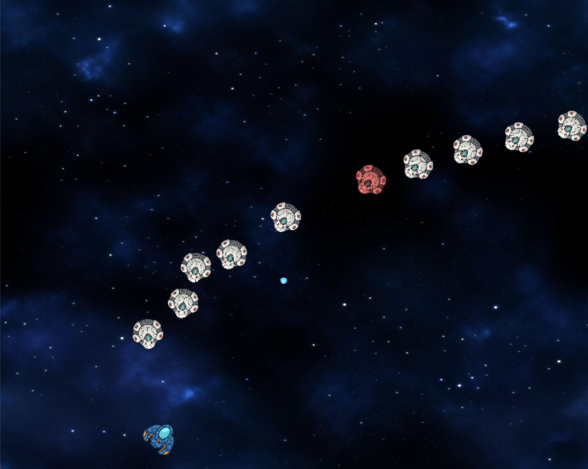

# 🚀 IsoShoot

**IsoShoot** is a 2D shooter prototype built with **C++**, **SDL3**, and **EnTT (ECS)**.  
The goal of this project is to explore the architecture of modern game engines — focusing on entity systems, event handling, resource management, and collision detection.

---

## 🧩 Technologies

- **C++20**
- **[SDL3](https://github.com/libsdl-org/SDL)** — low-level access to rendering, input, and windowing  
- **[EnTT](https://github.com/skypjack/entt)** — modern Entity–Component–System framework  
- **CMake** — cross-platform build system  
- **ECS architecture** featuring:
  - `InputSystem`
  - `MovementSystem`
  - `ShootingSystem`
  - `CollisionSystem`
  - `EnemyAISystem`
  - `ResourceManager`

---

## 🕹️ Features

- Entity creation and management (player, enemies, bullets)
- Lightweight ECS architecture using components like `Position`, `Velocity`, `Sprite`, and `Collider`
- Collision detection and event dispatching (`entt::dispatcher`)
- Simple camera and background system
- Resource manager for textures
- Modular and extendable structure suitable for building a full game engine

---

## 🧱 Project Structure

```
IsoShoot/
 ├── src/
 │   ├── Core/           — initialization, resource manager, input
 │   ├── ECS/            — components and systems
 │   │   ├── Components.hpp
 │   │   ├── Tags.hpp
 │   │   └── Systems/
 │   ├── Gameplay/       — factories, scenes, bullet pool
 │   └── main.cpp
 ├── external/           — third-party libs (EnTT / SDL)
 ├── Assets/             — textures, sounds (optional)
 ├── CMakeLists.txt
 └── README.md
```

---

## ⚙️ Build & Run

**Requirements:**
- Git
- CMake ≥ 3.20
- A C++20-compatible compiler  
  *(clang, gcc, msvc, or Xcode on macOS)*

**Commands:**

```bash
git clone git@github.com:ArchiBright/IsoShoot.git
cd IsoShoot
mkdir build && cd build
cmake ..
make
./IsoShoot
```

---

## 💥 Collision System Example

Collisions are handled via a simple `Collider` component and a dedicated `CollisionSystem`.  
When two entities overlap, the system triggers a `CollisionEvent` through `entt::dispatcher`,  
allowing any subscribed system to respond independently.

```cpp
struct Collider {
    float width, height;
    bool isTrigger = false;
};

dispatcher.trigger<CollisionEvent>({entityA, entityB});
```

---

## 🧠 Project Vision

**IsoShoot** is an educational framework inspired by the architecture of Unity and Godot.  
It aims to demonstrate clean ECS design, modularity, and system isolation.  
The project evolves step-by-step — from a single green square to a complete prototype with AI and collisions.

---

## 📸 Screenshots




---

## 🧭 Roadmap

- [ ] Player animation system  
- [ ] Particle effects (explosions, impacts)  
- [ ] Enemy AI with chase and attack states  
- [ ] Sound and music system  
- [ ] UI / HUD overlay  
- [ ] Level loading from JSON / tilemap  
- [ ] Save system  

---

## 🧑‍💻 Author

**ArchiBright**  
🎮 Game developer & ECS enthusiast  
📍 Canada  
💬 Contact via GitHub Discussions or Discord  

---

## 🪪 License

MIT License © 2025 ArchiBright  
You are free to use this code for educational or personal purposes.
